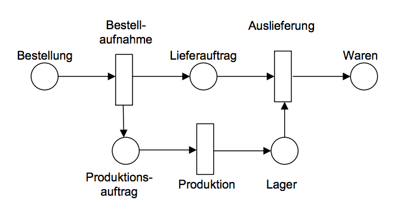
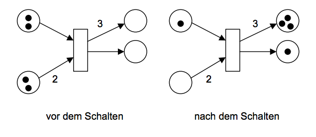

# Grundlagen Betriebssysteme
## Kapitel 3 - Parallele Systeme – Modellierung etc.
### Fragestellungen
* Sequentielle Aspekte
	* Programm = Algorithmus
	* Programm = Sequentielle Folge von Anweisungen
* Determinierte Programme (Unter gleichen Eingaben gleiche Ausgaben)
* Deterministische Programme (Eindeutig vorbestimmter Ablauf)
* Übergang von sequentiellen Systemen zu parallelen Systemen

### Beschreibungskonzepte
* Modell-basierte Konzepte (Ereignis-orientiert oder grafisch-orientiert)
* Sprachkonstrukte in Programmiersprachen (Java z.B. Threads)
* Konzepte in Betriebssystemen
	* Prozesskonzept
	* Threadkonzept
	* Kommunikation: Shared Memory, Dateien, Nachrichten
	* Synchronisation: Unterbrechungen, Sperren

### Modellierung paralleler Systeme
* Spezifikation von Verhalten
	* Abstraktion: Beschränkung auf interessierende Eigenschaften
* Nachweis von Eigenschaften (Determiniertheit, Störungsfreiheit, Wechselseitiger Ausschluss, Endloses Blockieren, Verhungern)
* Sicherheitseigenschaften
* Lebendigskeitseigenschaften

### Verhaltensbeschreibung
Beschreibung von Eigenschaften und deren Veränderungen über die Zeit. Duale Sichtweise aus *Aktionen* und *Ereignissen*.

**Ereignisspuren**: Folge von Ereignissen im zeitlichen Ablauf

**Zustandsspuren**: Folge von Zuständen im zeitlichen Ablauf

### Ereignisse und Aktionsstrukturen
**Prozess**: Tripel (E, ≤, α)

* Universum von Ereignissen E*
* Menge von Aktionen A
* Ereignismenge E ⊆ E*
* Kausalitätsrelation ≤ als partielle Ordnung über E
* Aktionsmarkierungen α zur Zuordnung von Ereignissen auf Aktionen

### Aktionen als Zustandsübergänge
Modell des Zustandsautomat mit Menge von **Zuständen S**, Menge von **Transitionsaktionen R**, Menge möglicher **Anfangszustände S0**

### Petri-Netze
* Graph mit Knoten und Kanten
* Knoten: Stellen (Kreis) und Transitionen (Rechteck)
* Kanten: S -> T oder T -> S
* Belegung der Stellen mit Marken (Token)
* Zustand: Belegung der Stellen
* Schaltregel: Abziehen und Hinzufügen von Token
* Markierung von Kanten

#### Beispiele

#### Schaltregel und Eigenschaften
* Markierung
	* Kapazität c
	* Gewichtung w
	* Markierung M
* Schaltregeln:

Mit Kantengewicht:

Nicht schaltbare Transition:

