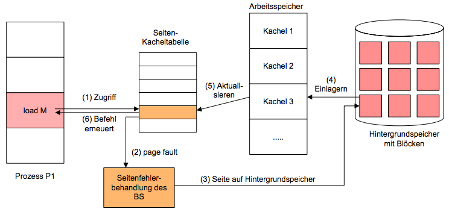

# Grundlagen Betriebssysteme
## Kapitel 5 - Speicherverwaltung

### Einführung
Motivation: Unmittelbare Nutzung des Arbeitsspeichers nicht empfehlenswert -> Abstraktion, Umgang mit Kapazitätsengpässen

**Adressräume**: Maschinenadressraum (fortlaufend numerierte Bytes, start bei 0 (reale Adresse)), Programmadressraum (idR virtueller Adressraum, prozessspezifisch). Aufgabe der Abbildung der Adressräume: Adressierung (direkt-, basis-, seiten- segment-seiten-).

Trennung von Adressräumen: **Programmcode**, **Datenbereich** (statisch), **Heap** (Datenbereich dynamisch), **Stack** (Laufzeitkeller).

Single-Threaded Adressraum:

Multi-Threaded Adressraum:

**Fragmentierung**: Zerstückelung des freien Teils des Adressraums

**Garbage Collection**: Speicherrepräsentation als Graph, markieren und freigeben nicht mehr erreichbarer Knoten

#### Anforderungen an Adressraumrealisierung
* Homogene und zusammenhängende Adressbereiche
* Unabhängig vom Arbeitsspeicher
* Erkennen fehlerhafter Zugriffe
* Erkennen von Überschneidungen (Heap und Stack)
* Schutz der Anwendungen gegeneinander
* Kontrollierbares und kontrolliertes Aufteilen der Speicherressourcen
* Minimale Fragmentierung

#### Speicherabbildungen
**Direkte Adressierung**: Eine Programmadresse wird als Maschinenadresse implementiert. Nachteile:

* Lücken (Fragmentierung) nach programmende
* Programmgröße auf Arbeitsspeicher beschränkt
* Speicherausnutzung schlecht

**Basisadressierung**: Maschinenadresse = Basisadresse + Programmadresse

* Basisadresse ist Programmspezifisch
* Programmadressen starten mit 0
* Speicherverwaltugnsstrategien:
	* first-fit, next-fit, best-fit, worst-fit
	
#### Seitenadressierung
* Prozessadressraum: Einteilung in Seiten (*pages*) gleicher Größe
* Maschinenadressraum
	* Einteilung in Kachenln (*frames*) gleicher Größe (idR wie Seitengröße)
* Seiten gespeichert im AS oder/und HS
* Zuordnung über Seitendeskriptoren in Seitent* abelle
* Einlagern nach Seitenfehler (*paging in*)
* Auslagern bei Platzbedarf (*paging out*)

Vorteile:

* Verschiebkarkeit möglich
* Größenbeschränkung aufgehoben
* Teilweise Speicherung im AS möglich
* Differenzierter Zugriffsschutz möglich
* Gemeinsame Speicherbereiche möglich

**Virtuelle Adresse**: v = (s,w)

**Reale Adresse**: r = (p,w)

Zuordnung von Virtueller Adresse zu Realer Adresse durch die MMU (Memory Management Unit):

#### Seiten-Kacheltabelle
* Seitendeskriptor
	* Zugriffsrechte (rwq)
	* Existent-Attribut (e)
	* Geladen-Attribut (v)
	* Zugegriffen-Attribut (r)
	* Verändert-Attribut (m)
	* Seitenadresse (s als **Index**)
	* Kacheladresse	(Kachel k/p)
	* Hintergrundspeicheradresse (Block b)

#### Seitenfehlerbehandlung
* Seitenfehler
	1. Beim Zugriff auf eine virtuelle Adresse tritt ein Seitenfehler auf
	2. MMU löst Alarm aus
	3. BS stellt freie Kachel zur Verfügung
	4. Seite wird eingelagert
	5. Seitendeskriptor wird aktualisiert
	6. Der unterbrochene Befehl wird erneut gestartet
	

