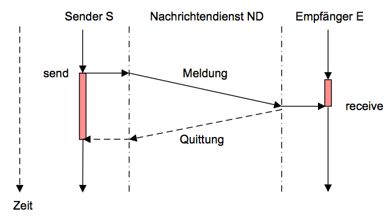
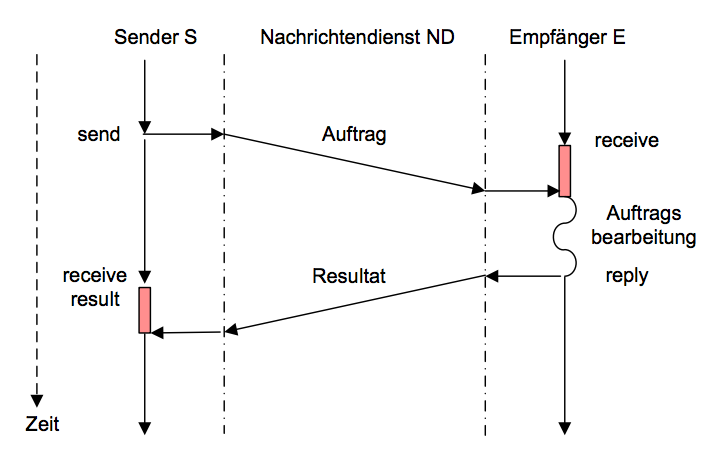
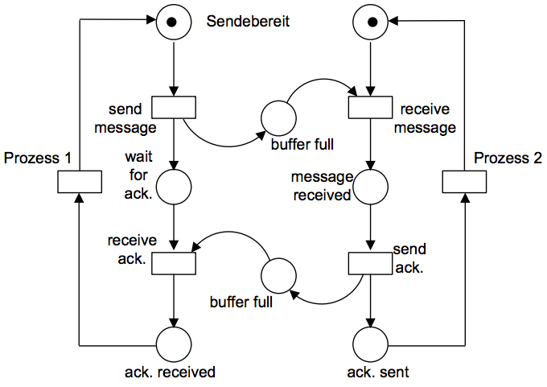
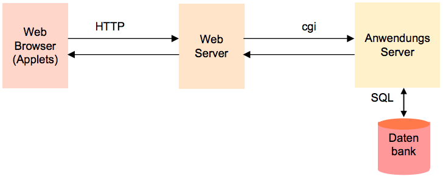
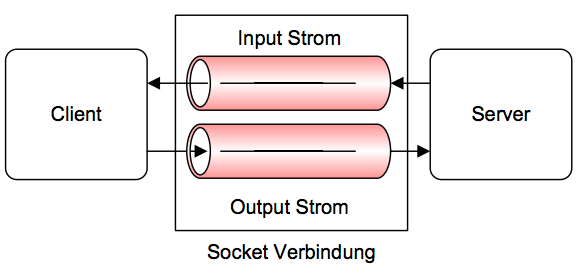

# Grundlagen Betriebssysteme
## Kapitel 6 - Prozesskommunikation
### Nachrichten-basierte Kommunikation
#### Kommunikationsarten
* Schmalbandige Kommunikation (Ereignisse, Flags, Unterbrechungen)
* Breitbandige Kommunikation
	* Implizit oder indirekt/mittelbar (z.B. gemeinsame Nutzung von Dateien, Speicher)
	* Explizit oder direkt/unmittelbar (SEND und RECEIVE basierte Kommunikation)
* Kommunikationsbeziehungen
	* 1:1 (unicast, anycast) Ein Puffer für Sender/Empfänger-Paar
	* 1:m (multicast) Mitteilung an eine Menge von Prozessen
	* 1:alle (broadcast) Mitteilung an alle Prozesse
	* n:1 n Sender senden an einen Empfänger

Explizite Kommunikationsformen:
* Nachrichtenbasierte Kommunikation mit SEND und RECEIVE
* Nachtichteninhalt = Nutzlast (Payload)

**Klassifikation** der Kommunikation in verteilten Systemen:

| | Multiprozessor | Multicomputer | verteiltes System |
|---|--------------|------------|-----------------|
|Konfiguration | nur CPU | CPU, RAM, Netz | kompletter Rechner |
|Peripherie | gemeinsam | gemeinsam, außer HDD | getrennt |
|Ort | gemeinsames gehäuse | gemeinsamer Raum | weltweit |
|Kommunikation | gemeiner RAM | direkte Verbindung | Netzwerk |
|Betriebssystem | gemeinsames BS | getrennt, aber gleicher Typ | getrennt, vielfach unterschiedlich |
|Verwaltung | eine Organisation | eine Organisation | viele Organisationen |

```
send(E: process, m: message)

recieve(S: process, m: message)
```

#### Meldung
idR unidirektionaler Nachrichtenaustausch. Asynchron: `send()` sofort abgeschlossen. Synchron:



#### Auftrag
bidirektionaler Nachrichtenaustausch. Synchron: `send()` dauert bis zur Antwort und liefert diese direkt. Asynchron:



**Vorteile von asynchronem Senden**:
* Nützlich für Realzeitanwendungen
* Ermöglicht parallele Abarbeitung
* Anwendbar zum Signalisieren von Ereignissen

**Nachteile von asynchronem Senden**:
* Verwaltung des Nachrichtenpuffers durch BS erforderlich
* Benachrichtigung des Senders S im fehlerfall und Behandlung von Fehlern ist problematisch
* Entwurf und Nachweis der Korrektheit ist schwierig

Erzeuger-Verbraucher Petri Netz:



#### Ports (Verbindungslos, Paket-Orientiert)
Einsatz z.b. in TCP/IP Kommunikation

> Port ist mit dem Adressraum des zugehörigen Prozesses verbunden, ein Empfängerprozess kann Sender-spezifische Ports einrichten

```
portID = createPort();
send(E.portID, message);
recieve(portID, message);
deletePort(portID);
```

#### Kanäle (Verbindungsorientiert)
Einrichten eines Kanals (Socket) zwischen Ports, bidirektionale Übertragung einzelner Pakete über Kanäle. Einsatz: TCP mit verbindungsorientierter Kommunikation

#### Ströme
übertragung von Datenströmen verdecken die Nachrichtengrenzen von Kanälen.

#### Pipes
Unidirektionaler Strom zwischen Kommunikationspartnern. Elternprozess erzeugt Pipe und Kindprozesse, Kindprozesse kommunizieren über Pipe. (auch: named pipes für Kommunikation beliebiger Prozesse)

Beispiel UNIX Pipes:

```bash
ls -l | head
grep "name" datei.txt | sort | more
```

### Client-Server-Modell
**Server** stellt als Auftragnehmer Dienste zur Verfügung, **Client** nutzt als Auftraggeber die Dienste. Synchrone Kommunikation. Client meist a priori nicht bekannt, da dynamisch erzeugte Benutzerprozesse. Server bekanntes Subsystem, das einen Dienst bereitstellt.


Ein Server kann auch selbst Client sein (**Multi-Tier Architektur**):



**Peer-to-Peer Computing**:
Keine Unterscheidung zwischen Server und Clients zur Eliminierung des Server-Flaschenhalses. Registrierung der Dienste über *Directory Service*.

### Netzwerkprogrammierung: Sockets
Einführung Verteilter Anwendungen durch Zerlegung der Anwendung in Subsysteme, welche *autonome Prozesse* sind. Eventuell relaisiert durch Client-Server-Modell.

Realisierung über Sockets, **Abstraktion** von Medium, Paketgrößte, Paketwiederholung und Netzadresse:



**Basisoperationen**:
* Richte Verbindung ein (`connect`)
* Sende Daten
* Empfange Daten
* Schließe Verbindung
* Assoziiere Socket mit einem Port
* Warte auf eintreffende Daten (`listen`)
* Akzeptiere Verbindungswünsche von entfernten Rechnern (oder Ports)

Beispiel: Sockets in UNIX

```c
// SERVER
int sock, consock;								// socket Dateideskriptoren

sock = socket(AF_INET, SOCK_STREAM, 0);		// erzeugen

bind(sock, ...);
listen(sock, 5);								// erlaube Verbindungsaufnahme

consock = accept(sock, ...);					// Verbindungsannahme
nread = read(consock, buf, sizeof(buf));		// Empfangen von Daten

close(consock); close(sock);

// CLIENT
int sock										// socket Dateideskriptor

sock = socket(AF_INET, SOCK_STREAM, 0);		// erzeugen

connect(sock, ...);								// Verbindungsaufbau

write(sock, ...);								// Senden von Daten

close(sock);
```
