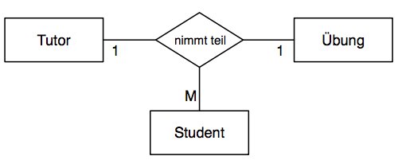

# Grundlagen Datenbanken
## 1. Einleitung
### Gründe/Argumente für Datenbanksysteme
1. Eigene Datenformate sind unflexibel, da kein Pfad zur Erweiterung, Verteilung, Recovery etc. exisitert
2. Einsatz eines Komplexen Produkts nicht notwendig, schlanke Versionen wie z.b. SQLite
3. Mehrbenutzersynchronisation kommt meist (wenn auch nachträglich), Datenbanksysteme haben dafür eine Lösung
4. Auch eigene Datenformate/APIs müssen erlernt werden, SQL ist stnadardisiert
5. Datenbanksysteme bieten kontrollierte Redundanz

### Relationales vs. Graphstrukturiertem Modell
**Relational**: Einsatz z.B. für ein CMS.

**Graphstrukturiert**: Dateinspeicherung in der Bioinformatik/Medizin, inhärent graphstrukturierte Daten wie U-Bahn Netze

## 2. Konzeptionelle Modellierung
### Konsitenzbedingungen
#### Funktionalitätsangaben


Bedeutet:
* `1` Tutor *nimm* an `1` Übung *teil*
* `M` Studenten *nehmen* an `1` Übung *teil*
* `1` Übung wird von `1` Tutor *geleitet*
* `1` Übung wird von `M` Studenten *besucht*

Es gelten die Partiellen Funktionen:
```
Tutor x Student --> Übung
Übung x Student --> Tutor
aber
Tutor x Übung -/-> Student
```
**Faustregel**: In FDs rechts stehende Relationen erhalten eine Funktionalität von `1`.

> Wie oft sind Entitäten einer Relation an einer Instanz der Beziehung beteiligt?

#### Min-Max Angaben
Modellierung folgender Einschränkungen im MinMax Modell:
* Ein Tutor hält mindestens eine Übung
* Eine Übung wird von mindestens einem Studenten besucht
* Ein Student kann höchstens eine Übung besuchen


Verbindung zu einer Realtionstabelle (im Beispiel mit `TutorName`, `GruppenNr` und `MatrNr`):
Jede Eintität kommt in der jeweiligen Spalte so oft vor, wie es die MinMax Notation vorschreibt.

> Wie oft darf eine Entität in einer Beziehungsrelation vorkommen?

## 4. Relationale Anfragesprache
### Relationale Algebra
#### `σ` - Selektion (Sigma)
Nimmt ein Prädikat und prüft jedes Tupel einzeln ob der Erfüllung des Prädikats.

#### `π` - Projektion (Pi)
Selektiert nur die im Subskript angegebenen Attributnamen. Hierdurch entstehende Duplikate werden eliminiert.

#### `ρ` - Umbenennung (Rho)
Umbenennen von Relationen. Zum Umbenennen von einzelnen Attributen: `ρ Voraussetzen <- Vorgänger (voraussetzen)`.

#### `∪` - Vereinigung
Relationen mit *gleichen Attributnamen und -typen* können zu einer Relation zusammengefasst werden.

#### `-` - Mengendifferenz
Für zwei Relationen mit gleichem Schema ist die Mengendifferenz `R - S` die Relation der Tupel, die in `R` aber nicht in `S` vorkommen.

#### `×` - Kathesisches Produkt
Kreuzprodukt zwischen zwei Relationen, enthält `|R| * |S|` Tupel.

#### `⨝`- Natural-Join
Kreuzprodukt zwischen zwei Relationen, wobei nur Paare behalten werden, die in *gleich benannten Attributen* **übereinstimmen**.

#### `⨝` - Allgemeiner Join
Wie *Natural-Join*, aber mit frei wählbarem Prädikat zur Verbindung von Tupeln.

#### `⟕` - Left Outer Join
Die Tupel der **linken** Argumentrelation bleiben auch ohne Gegenstück erhalten (führt zu Null-Werten)

#### `⟖` - Right Outer Join
Siehe *Left Outer Join*

#### `⟗` - (Full) Outer Join
Siehe *Left Outer Join*, aber es bleiben beide Seiten erhalten.

#### `⋊` - Left Semi Join
Es bleiben nur Tupel aus der **linken** Argumentrelation erhalten und nur, wenn sie ein Gegenstück finden.

#### `⋉` - Right Semi Join
Siehe *Left Semi Join*

#### `▷` - Anti Semi Join
Es bleiben nur Tupel aus der **linken** Argumentrelation erhalten, die **kein** Gegenstück finden. Definiert als `L ▷ R = L - (L ⋉ R)`

### Tupel-/Domänenkalkül
> Finden Sie alle Studenten, die alle Vorlesungen gehort haben, die von Sokrates gelesen
wurden.

#### Relationaler Algebra
1. Wir ermitteln alle von Sokrates gelesenen Vorlesungen
2. Durch Anwendung des Divisionsoperators bekommen wir die Matrikelnummern der Studenten, die alle von Sokrates gehaltenen Vorlesungen gehört haben
3. Aus Studenten ermitteln wir zusätzlich die Namen der Studenten


#### Tupelkalkül
1. Wie ermitteln mittels des **Allquantors** alle Vorlesungen, die von Sokrates gehört werden
2. Wir fordern, dass ein Student alle diese Vorlesungen gehört hat (**Implikation** und **Existenzquantor**)


#### Domänenkalkül
Vorgehen relativ analog zum relationalen Tupelkalkül

;

### SQL
#### Select
> Finden Sie alle Studenten, die Sokrates aus Vorlesungen kennen

```sql
SELECT DISTINCT s.*
FROM Vorlesungen v, Professoren p, Studenten s, hoeren h
WHERE p.name = 'Sokrates'
	AND v.gelesenVon = p.persNr
    AND v.vorlNr = h.vorlNr
    AND s.matrNr = h.matrNr
```

> Finden Sie die Studenten, die Vorlesungen horen, die auch Fichte hort.

```sql
SELECT s1.*
FROM Studenten s1, Studenten s2, hoeren h1, hoeren h2
WHERE s2.name = 'Fichte'
	AND s1.matrnr = h1.matrnr
	AND h1.vorlnr = h2.vorlnr
    AND h2.matrnr = s2.matrnr
	AND s1.matrnr != s2.matrnr
```


#### Create

## 5. Datenintegrität
### Typensystem

### Primärschlüssel

### Trigger
Verstehen

### Check Constraints
Verstehen

## 6. Relationale Entwurfstheorie
### Normalformen
#### 1. Normalform

#### 2. Normalform

#### 3. Normalform

#### Boyce-Kott Normalform

### Synthesealgorithmus

### Dekompositionsalgorithmus

## 7. Physische Datenorganisation
### B-Bäume

### B+ Bäume

### Hashing

### TIDs (Tupel IDs)

## 8. Anfragebearbeitung
### Logische Optimierung

### Join ALgorithmen
(Vor- und Nachteile kennen)

### Externes Sortieren

## 9. Transaktionsverwaltung
### ACID

## 10. Fehlerbehandlung/Recovery & 11. Mehrbenutersynchronisation